= id="inicio"
# Ejemplos

Veamos a un caso de ejemplo de una institución genérica que incorporo a un
nuevo encargado de Activos Fijos y se le pregunta que requiere para trabajar.

---
= id="ActivosFijos" data-x="0" data-y="1000" data-z="0"

## Activos Fijos

### Requerimientos

- Como _Responsable de Activos_, quiero __una hoja de excel para llevar el registro de los activos__
- Como _Responsable de Activos_, quiero __el valor en libros del los distintos almacenes__
- Como _Responsable de Activos_, quiero __el valor en libros por tipo de activo__

---
= id="simple" data-x="0" data-y="2000" data-z="0"

Parece simple, ¿verdad?

---
= id="SolucionI" data-x="1000" data-y="0" data-z="0"

# Solución I

Le damos lo que pide

pero

... Unos días después ...

---
= id="ProblemasOcasionados" data-x="1000" data-y="1000" data-z="0" data-rotate-x="0" data-rotate-y="000" data-rotate-z="00" data-scale="1"

## Problemas Ocasionados

- Mantener una hoja de calculo para 1.000.000 de items no es practico
- Generar los cuadros de depreciación por Activos es una tarea heroica

---
= id="ActivosFijosII" data-x="1000" data-y="2000" data-z="000" data-rotate-x="000" data-rotate-y="000" data-rotate-z="000" data-scale="1"

## Activos Fijos

### Requerimientos II

- Como _Responsable de Activos_, quiero __una hoja electrónica para llevar el registro de los activos de la institución__
- Como _Responsable de Activos_, quiero __el valor en libros agrupado por almacenes y por tipo de activo__

---
= data-x="2000" data-y="000" data-z="000" data-rotate-x="000" data-rotate-y="000" data-rotate-z="000" data-scale="1"

## Activos Fijos

### Requerimientos II

- Como _Responsable de Activos_, quiero __el cuadro de depreciación de cada tipo de activo__
- Como _Responsable de Activos_, quiero __la Localización de Activos__
- Como _Responsable de Activos_, quiero __poder Asignar a los empleados los Activos__

---
= data-x="2000" data-y="000" data-z="1000" data-rotate-x="000" data-rotate-y="000" data-rotate-z="000" data-scale="1"

## Activos Fijos

### Requerimientos II
- Como _Responsable de Activos_, quiero __la información sobre la garantía delos Activos__
- Como _Responsable de Activos_, quiero __poder Etiquetar los activos__
- Como _Responsable de Activos_, quiero __buscar los Activos por sus campos principales__

---
= data-x="2000" data-y="1000" data-z="000" data-rotate-x="000" data-rotate-y="000" data-rotate-z="000" data-scale="1"

## Solución II

- Divide y Vencerás (desde el Imperio Romano {228 a.c.} a nuestros días )
- Heurística en Software Libre

---
= data-x="2000" data-y="2000" data-z="000" data-rotate-x="000" data-rotate-y="000" data-rotate-z="000" data-scale="1"

## Divide y Vencerás

En política y psicología, divide y vencerás o dividir para reinar (del
griego: διαίρει καὶ βασίλευε, diaírei kaì basíleue) es ganar y mantener el
poder mediante la ruptura en piezas de las concentraciones más grandes, que
tienen individualmente menos energía. El concepto se refiere a una estrategia
que rompe las estructuras de poder existentes y evita la vinculación de los
grupos de poder más pequeños. Podría ser utilizada en todos los ámbitos en
los que, para obtener un mejor resultado, es en primer lugar necesario o
ventajoso romper o dividir lo que se opone a la solución o a un determinado
problema inicial.

---
= data-x="000" data-y="3000" data-z="000" data-rotate-x="000" data-rotate-y="000" data-rotate-z="000" data-scale="1"

## Divide y Vencerás

En las ciencias de la computación, el término divide y vencerás (DYV) hace
referencia a uno de los más importantes paradigmas de diseño algorítmico. El
método está basado en la resolución recursiva de un problema dividiéndolo en
dos o más subproblemas de igual tipo o similar. El proceso continúa hasta que
éstos llegan a ser lo suficientemente sencillos como para que se resuelvan
directamente. Al final, las soluciones a cada uno de los subproblemas se
combinan para dar una solución al problema original.

---
= data-x="000" data-y="4000" data-z="000" data-rotate-x="000" data-rotate-y="000" data-rotate-z="000" data-scale="1"

## Heurística en Software Libre

El problema no solo es mio, entonces ya debe haber alguien con una solución

- Buscar Solución en Software Libre
- Escoger una
- Probar si cumple con mis: Requerimientos y/o Casos de Aceptación.
- Si no cumple, entonces: probar otra

---
= data-x="00" data-y="5000" data-z="000" data-rotate-x="000" data-rotate-y="000" data-rotate-z="000" data-scale="1"

## Heurística en Software Libre

- Probé muchas y ninguna me convence
  - Escoger la mas cercana y adaptarla
  - Crear un proyecto Nuevo

---
= data-x="1000" data-y="3000" data-z="000" data-rotate-x="000" data-rotate-y="000" data-rotate-z="000" data-scale="1"

## Activos Fijos

### Divide y conquistaras

- ¿Qué puedo dividir?

---
= data-x="1000" data-y="4000" data-z="000" data-rotate-x="000" data-rotate-y="000" data-rotate-z="000" data-scale="1"

## Heurística Software Libre

### ¿Qué alternativas tengo?

- __OpenBravo__, OBPL, Java, PostgreSQL, España.
- __ODOO__, AGPL3, Python, Javascript, PostgreSQL, Alemania (varios otros).
- __WebERP__, GPL2, PHP MySQL, ¿?.
- __OpenXpertya__, Licencia Pública OpenXpertya, Java, PostgreSQL, Firebird, España.
- __HeliumV__, AGPL, Java, Austria, Alemania.
- __Apache OFBiz__, ApacheV2, Java.

---
= data-x="1000" data-y="4000" data-z="-1000" data-rotate-x="000" data-rotate-y="000" data-rotate-z="000" data-scale="1"

## Heurística Software Libre

### ¿Qué alternativas tengo?

- __Postbooks__, CPAL, C++, Javascript, PostgreSQL, EEUU.
- __Adaxa Suite__, GPL, Java, Australia.
- __Adempiere__, GPL, Java, Varios Paices.
- __ERP5__, GPL, Python, Javascript, Zope, MySQL, Varios Paices.
- __ERPNEXT__, GPL, Python, Javascript, MariaDB, India.
- __Compiere__, GPL/Comercial, Java, EEUU

---
= data-x="1000" data-y="5000" data-z="000" data-rotate-x="000" data-rotate-y="000" data-rotate-z="000" data-scale="1"

# ODOO

- __Lenguaje:__ Python
- __Licencia:__ AGPLv3
- __Arquitectura:__ Web, multi-capa

## ¿ Cumple Con lo que __Requiero__ ?

---
= data-x="2000" data-y="3000" data-z="000" data-rotate-x="000" data-rotate-y="000" data-rotate-z="000" data-scale="1"

## ODOO

### Le falta:

- Detalles en la Localización de Activos
- Asignar a los empleados de Activos
- Información sobre la garantía de los Activos
- Estados personalizados de Activos
- Estados de Activos, diferentes por equipo:
  - Finanzas
  - Almacén
  - Producción
  - Mantenimiento
  - Contabilidad
- Etiquetas de activos
- Búsqueda por campos principales

---
= data-x="2000" data-y="4000" data-z="000" data-rotate-x="000" data-rotate-y="000" data-rotate-z="000" data-scale="1"

## _Pero Existe un modulo para_ __ODOO__ _que si tiene_

- [Activos en Odoo](https://www.odoo.com/apps/modules/9.0/asset/)

---
= id="Dudas" data-x="2000" data-y="5000" data-z="000" data-rotate-x="000" data-rotate-y="000" data-rotate-z="000" data-scale="1"

# ¿Dudas?

---
= data-x="000" data-y="000" data-z="4000" data-rotate-x="90" data-rotate-y="0" data-rotate-z="0" data-scale="1"

## Tenemos datos que publicar

### hay mas de 1000 conexiones simultaneas

- UMSS, UMSA, ..., etc
- INE
- OEP
- Los Tiempos, La Razón, ..., etc

---
= id="IdentificarElProblema" data-x="00" data-y="1000" data-z="-500" data-rotate-x="00" data-rotate-y="90" data-rotate-z="00" data-scale="1"

## Identificar el Problema

- __Procesador__
- __Memoria__
- __Lenguaje__ (C++, Java, PHP)
- __Arquitectura__
- __Base de Datos__ (MariaDB, PostgreSQL)
- __Servidor HTTP__ (Apache, nginx, Cherokee)
- __Politicas de Seguridad__
- ___Ancho de Banda___

---
= data-x="000" data-y="2000" data-z="-1000" data-rotate-x="00" data-rotate-y="00" data-rotate-z="90" data-scale="1"

## Facebook

- [HipHop for PHP](https://en.wikipedia.org/wiki/HipHop_for_PHP)

---
= data-x="000" data-y="2000" data-z="-1000" data-rotate-x="00" data-rotate-y="90" data-rotate-z="90" data-scale="1"

## Facebook

- [Máquina Virtual HipHop HHVM](https://en.wikipedia.org/wiki/HipHop_Virtual_Machine)

---
= data-x="000" data-y="2000" data-z="-2000" data-rotate-x="00" data-rotate-y="90" data-rotate-z="90" data-scale="1"

## Pero no se como es la infraestructura de Facebook

---
= data-x="1000" data-y="2000" data-z="-1000" data-rotate-x="00" data-rotate-y="90" data-rotate-z="90" data-scale="1"

## Wikipedia

- Hasta el 2004 solo usaban un servidor
- Actualmente recibe entre **25.000 y 60.000** consultas por segundo

---
= data-x="000" data-z="4000" data-z="-2000" data-rotate-y="90"

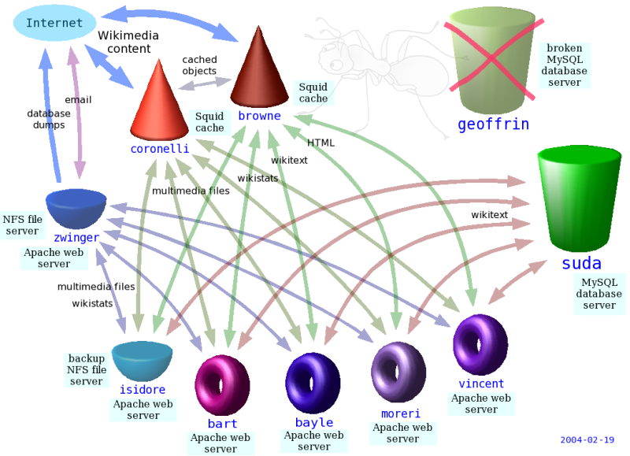

---
= data-x="000" data-z="5000" data-z="-3000" data-rotate-y="90"

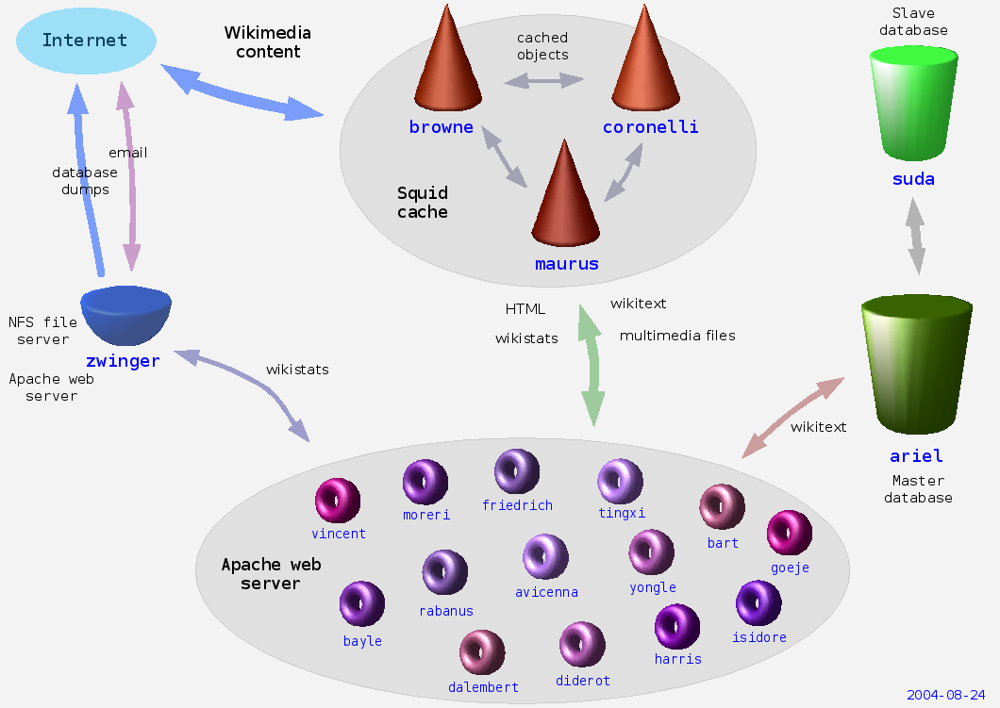

---
= data-x="000" data-z="6000" data-z="-3000" data-rotate-y="90"

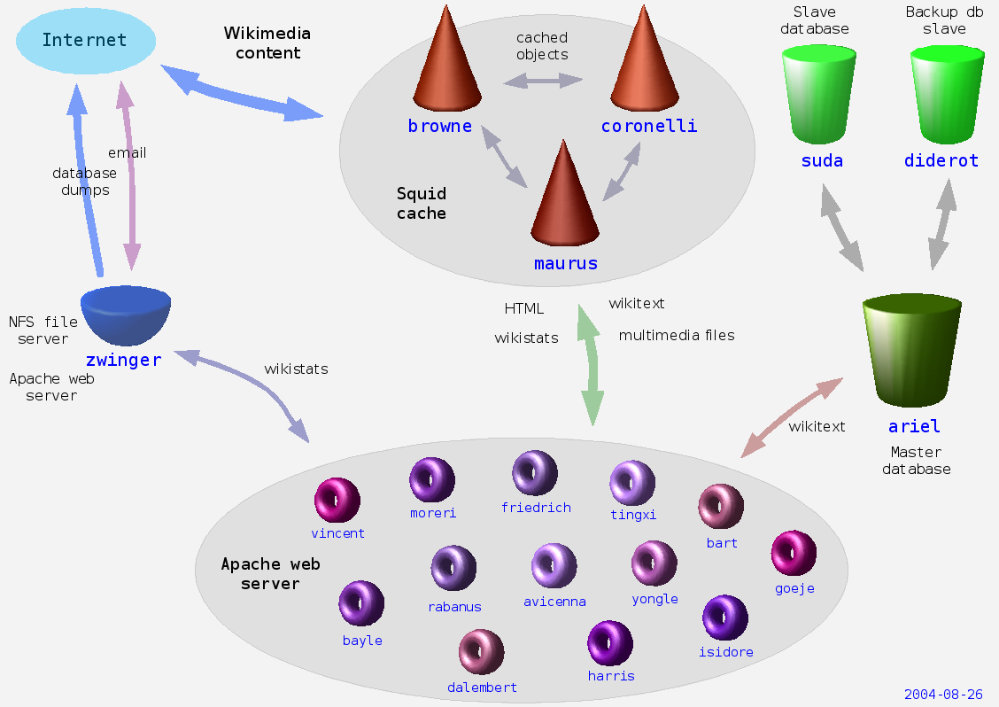

---
= data-x="1000" data-z="4000" data-z="-3000" data-rotate-x="90"

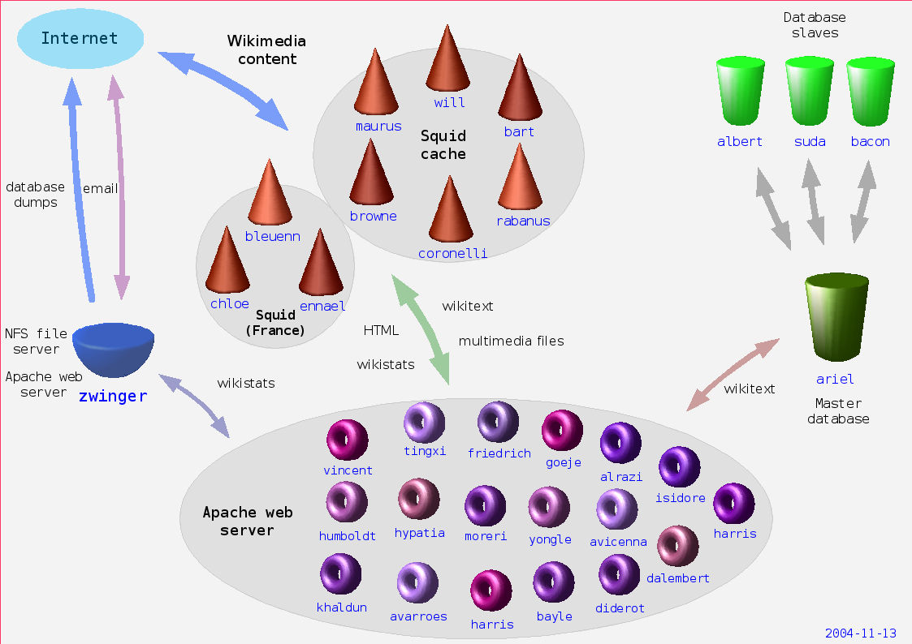

---
= data-x="1000" data-z="5000" data-z="-3000" data-rotate-y="90"

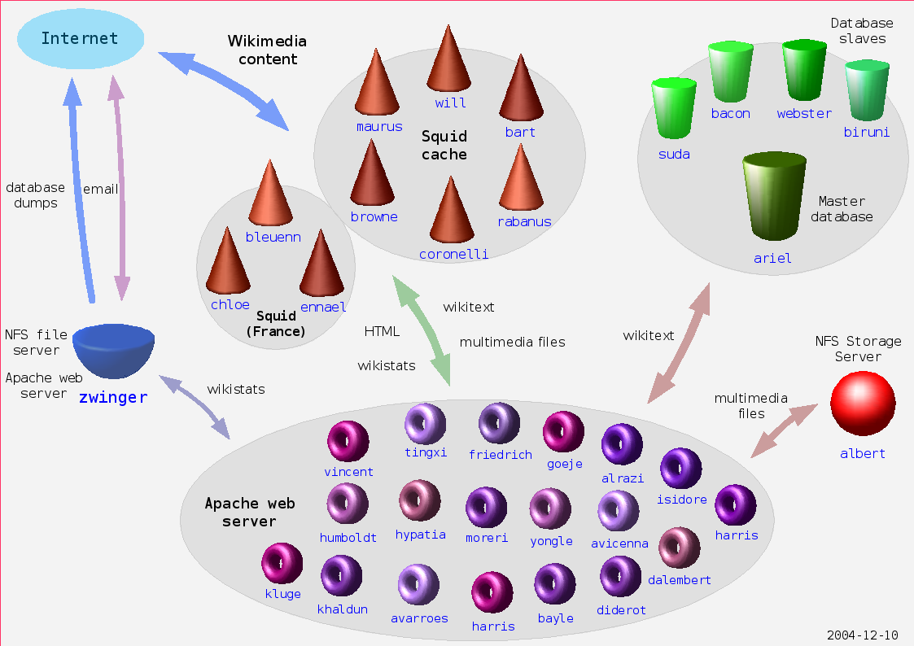

---
= data-x="1000" data-z="6000" data-z="-3000" data-rotate-y="90"

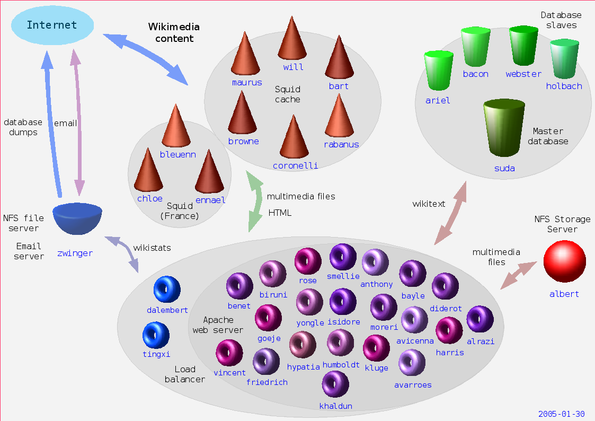

---
= data-x="2000" data-z="4000" data-z="-3000" data-rotate-y="90"

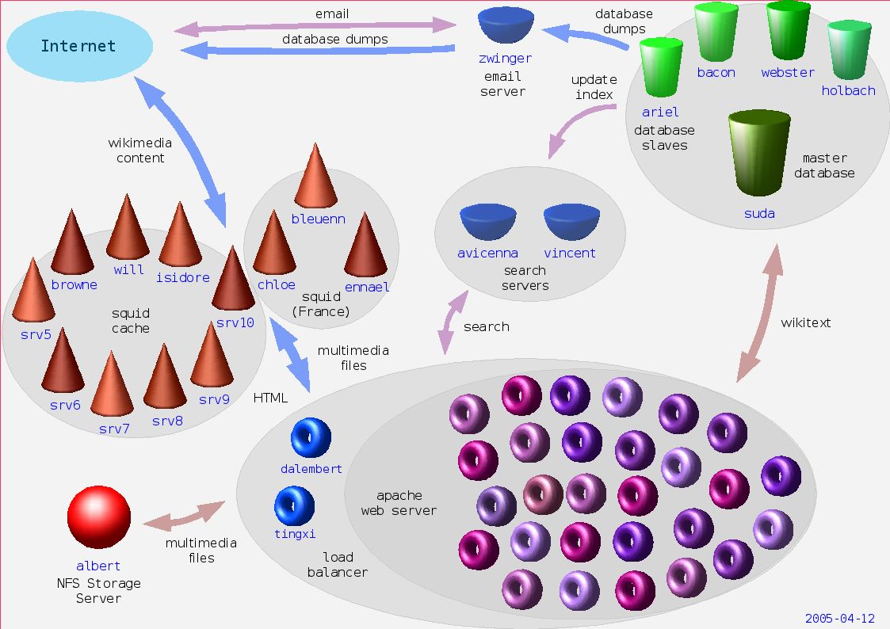

---
= data-x="2000" data-z="5000" data-z="-3000" data-rotate-y="90"

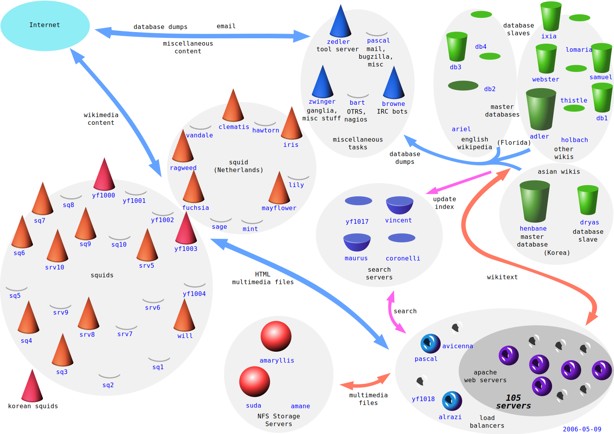

---
= data-x="2000" data-z="6000" data-z="-2000" data-rotate-y="90"

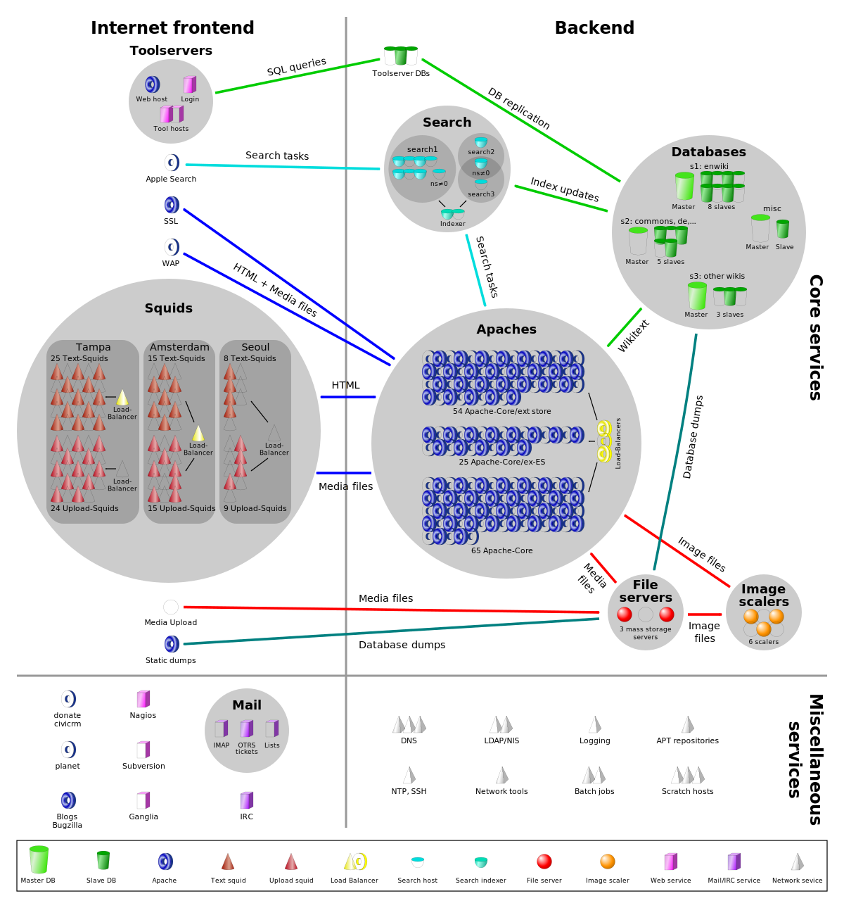

---
= data-x="3000" data-z="4000" data-z="-2000" data-rotate-y="90"

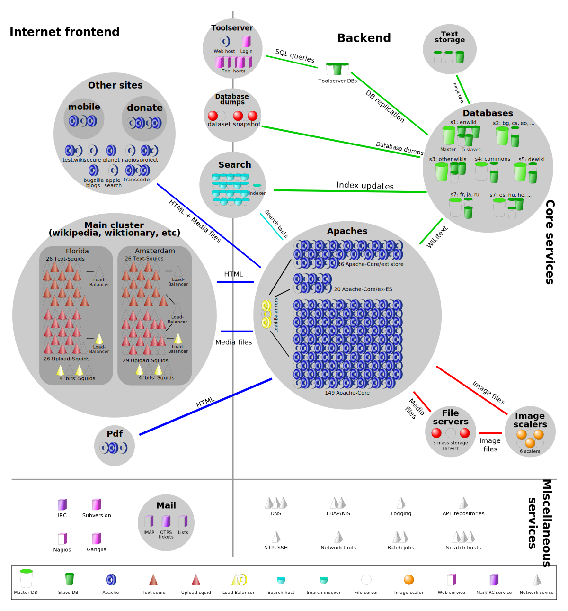

---
= data-x="3000" data-z="5000" data-z="-1000" data-rotate-y="90"

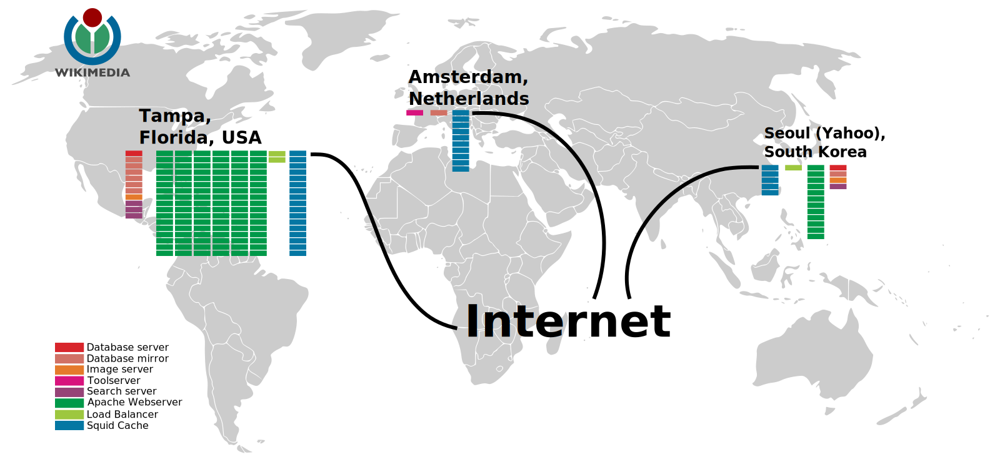

---
= data-x="000" data-y="000" data-z="-1000" data-rotate-x="00" data-rotate-y="00" data-rotate-z="90" data-scale="1"

## NetCraft

[Datos](../news.netcraft.com/archives/2016/04/21/april-2016-web-server-survey.html)

---
= id="Fin" data-x="1000" data-y="000" data-z="1000" data-rotate-x="1000" data-rotate-y="000" data-rotate-z="000" data-scale="1"

# Fin

## ¡¡¡ Gracias !!!
