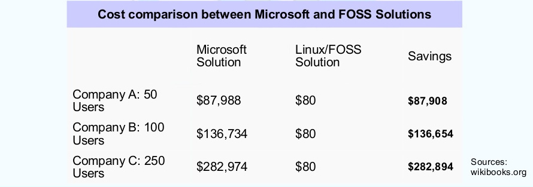

# Software Libre
## *una introducción*

> CTIC - Grupo Software Libre

---

**Richard Stallman**

*AI Lab, Massachusetts Institute of Technology*

Fundador del proyecto GNU y de la Free Software Foundation

---

# Que es el software libre ? 

---

1. No es una cuestión de precio
1. **NO** tiene nada que ver con el concepto de **GRATIS**
1. Es software que respeta la libertad de los usuarios.

---

# HAY DOS CASOS

* El software controla el usuario
* El usuario controla el software

---

# Las 4 libertades fundamentales

---

## 0 - USO

> Libertad de ejecutar el programa como se desea, con cualquier propósito

---

## 1 - Estudio

> Libertad de estudiar cómo funciona el programa, y cambiarlo para que haga lo que usted quiera. El acceso al código fuente es una condición necesaria para ello

---

## 2 - Distribución

> Libertad de redistribuir copias para ayudar a su prójimo

---

## 3 - Mejora

> Libertad de distribuir copias de sus versiones modificadas a terceros. Esto le permite ofrecer a toda la comunidad la oportunidad de beneficiarse de las modificaciones. El acceso al código fuente es una condición necesaria para ello 

---

# Donde se utiliza ?

* Linux domina el mercado de servidores
* Linux domina el mercado de celulares y tablets

---

# Cuanto Cuesta ?

- mejor dicho, cuando puedo invertir ?

---

---

# GRACIAS

---
